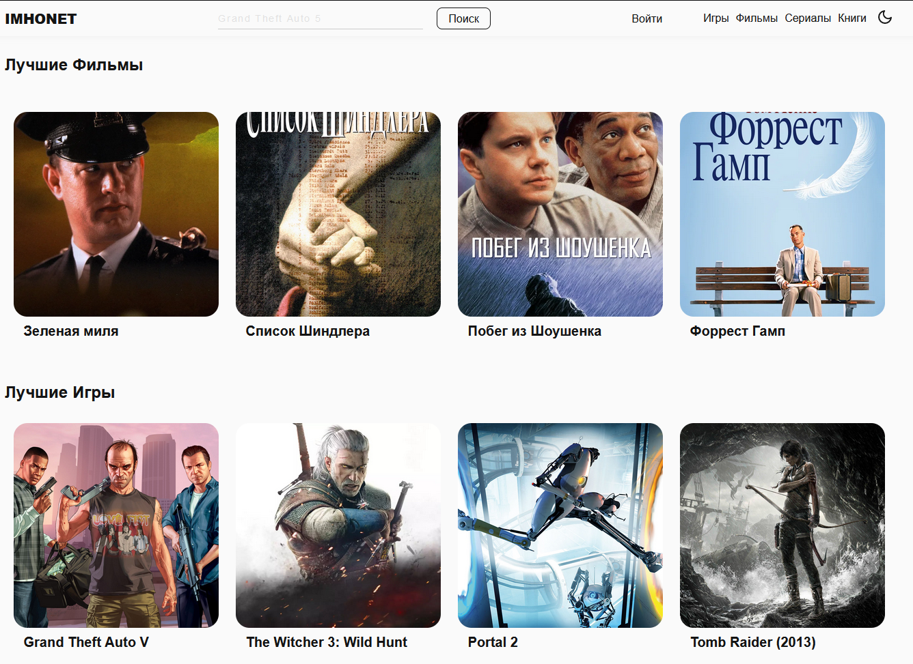

# [Imhonet](https://imhonet-7f568.web.app)

[Imhonet](https://imhonet-7f568.web.app) - храни все в одном месте с одним профилем. Вам больше не нужно заходить на различные сайты чтобы добавить в список желаемого разный контент, достаточно всего одного. Вы можете просматривать информацию о различных фильмах, играх, сериалах, книгах, составлять списки, вести профиль, смотреть статистику, оставлять оценки и отзывы, создавать подборки и многое другое!



---

## Установка локально:

1. Склонируйте проект себе
2. Установите зависимости командой `npm install`
3. Зарегестрируйтесь в [firebase](https://firebase.google.com/)
4. Войдите в аккаунт локально
5. Создайте `.env.local` файл в корне проекта со следующими названиями:

```
REACT_APP_FIREBASE_API_KEY = ...
REACT_APP_FIREBASE_AUTH_DOMAIN = ...
REACT_APP_FIREBASE_DATABASE_URL = ...
REACT_APP_FIREBASE_PROJECT_ID = ...
REACT_APP_FIREBASE_STORAGE_BUCKET = ...
REACT_APP_FIREBASE_MESSAGING_SENDER_ID = ...
REACT_APP_FIREBASE_APP_ID = ...


Вместо ... подставьте свое значение, указанное в консоли firebase
```

6. Запустите проект с помощью команды `npm start`

---

## Технологии

- React
- Typescript
- Redux Toolkit
- ReactRouterDom
- Firebase
- SCSS modules
- esLint, prettier

---

## Страницы

- Главная с новым и ожидаемым контентом (на ней сразу ленты с фильмами, играми, сериалами)
- Регистрация
- Фильм / Сериал / Игра / Книга
- Категории
- Профиль
- Избранное / Отложенное / Отмеченное

---

## apis

- [Игры](https://rawg.io/apidocs)
- [Фильмы](https://kinopoiskapiunofficial.tech/)
- [Сериалы](https://tvmaze.com/api)
- [Книги](https://www.googleapis.com/books/)

---

## Реализованные функции:

- Профиль пользователя
- Оценка и написание отзывов
- Поиск
- Создание, редактирование, удаление списков
- Регистрация
- Валидация форм
- Редактирвоание профиля
- Просмотр фильмов
- Пагинация

---

## В процессе

- Статистика
